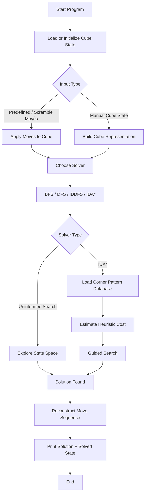

# Rubik's Cube Solver

A high-performance **3x3 Rubik's Cube solver in C++** that models the cube using multiple memory representations and solves scrambles using **BFS, DFS, IDDFS, and IDA*** with a **corner pattern database heuristic**.

---

## Problem Statement

Solving a 3x3 Rubik's Cube programmatically is a classic state-space search problem. The challenge is not only to find a valid solution, but to do so **efficiently** across a huge search space.

In practical terms, this project addresses three core problems:

- Representing cube states in memory efficiently
- Searching large state spaces without excessive runtime or memory usage
- Improving solver performance using informed search techniques such as **IDA*** and **pattern databases**

This makes the project relevant to real-world domains like:

- search and optimization systems
- AI problem solving
- heuristic design
- memory-efficient state modeling
- algorithm benchmarking

---

## Solution Overview

This project implements a complete virtual 3x3 Rubik's Cube environment and multiple solving strategies.

Key highlights:

- Multiple cube representations:
  - `3D Array`
  - `1D Array`
  - `Bitboard`
- Uninformed search algorithms:
  - `BFS`
  - `DFS`
  - `IDDFS`
- Informed search:
  - `IDA*`
- Heuristic acceleration using a **Corner Pattern Database**
- Modular C++ design for easy extension and benchmarking

The solver is designed to balance:

- correctness
- speed
- modularity
- low-memory state handling

---

## System Design / Architecture

The project is structured into three major layers:

### 1. Cube Representation Layer

Responsible for modeling cube state and applying legal moves.

- `GenericRubicksCube`
- `RubiksCube3dArray`
- `RubiksCube1dArray`
- `RubiksCubeBitboard`

### 2. Solver Layer

Responsible for exploring the cube state space and reconstructing the solution path.

- `BFSSolver`
- `DFSSolver`
- `IDDFSSolver`
- `IDAstarSolver`

### 3. Heuristic / Database Layer

Responsible for estimating search cost and improving informed search performance.

- `PatternDatabase`
- `CornerPatternDatabase`
- `CornerDBMaker`
- `NibbleArray`
- `PermutationIndexer`

---

## Flowchart



---

## Modules / Features

### Core Modules

- **Cube Engine**
  - Models a valid 3x3 Rubik's Cube
  - Supports all standard face moves:
    - `L`, `R`, `U`, `D`, `F`, `B`
    - prime moves
    - double turns
  - Includes helpers for inversion, printing, and random shuffling

- **State Representations**
  - `3D Array` for clarity and easy debugging
  - `1D Array` for compact linear indexing
  - `Bitboard` for efficient memory usage and faster state manipulation

- **Search Solvers**
  - `BFS` for shortest-path solving on smaller scrambles
  - `DFS` for depth-limited exploration
  - `IDDFS` for iterative deepening with reduced memory footprint
  - `IDA*` for faster heuristic-guided solving

- **Pattern Database**
  - Corner-based heuristic database
  - Improves informed search efficiency
  - Uses compact nibble-based storage for memory savings

### Key Features

- Multiple interchangeable cube representations
- Standard move generation and inversion support
- Hashable cube states for fast visited-state lookup
- Deterministic demo runs in `main.cpp`
- Modular design for extending heuristics or adding new solvers
- Local database support for heuristic acceleration

---

## Tech Stack

- **Language:** C++
- **Standard:** C++20
- **Build Tools:** `clang++` / `g++`, optional `CMake`
- **Algorithms:** BFS, DFS, IDDFS, IDA*
- **Optimization Techniques:**
  - Bitboard encoding
  - Pattern databases
  - Compact nibble-array storage

---

## Installation & Setup

### Prerequisites

- C++20-compatible compiler
  - `clang++` or `g++`
- `git`
- Optional: `cmake`

### Clone the Repository

```bash
git clone https://github.com/Nishkarsh0Sharma/Rubik_s_Cube.git
cd Rubik_s_Cube
```

### Build Using `clang++`

```bash
clang++ -std=c++20 -I. -IPatternDatabase \
main.cpp \
PatternDatabase/GenericRubicksCube.cpp \
PatternDatabase/Patterns/NibbleArray.cpp \
PatternDatabase/Patterns/PatternDatabase.cpp \
PatternDatabase/Patterns/CornerPatternDatabase.cpp \
PatternDatabase/Patterns/CornerDBMaker.cpp \
PatternDatabase/Patterns/math.cpp \
-o rubiks
```

### Run

```bash
./rubiks
```

### Optional: Build With CMake

```bash
cmake -S . -B build
cmake --build build
./build/Rubik_s_Cube
```

---

## Usage

### Current Input Method

At the moment, the project runs as a **C++ console application**.

The cube input is currently provided in these ways:

- **Predefined move sequences in `main.cpp`**
  - Example: a scramble is applied using a vector of moves before calling a solver
- **Programmatic scrambling**
  - Through `randomShuffleCube(...)`
- **Manual state construction**
  - By using cube methods such as `setColor(...)` and move functions

### How the Project Takes Rubik's Input

Right now, the primary input flow is:

1. Create a cube object
2. Apply scramble moves programmatically
3. Pass the cube to a selected solver

Example from the current workflow:

```cpp
RubiksCubeBitboard cube;

const vector<GenericRubicksCube::MOVE> scramble = {
    GenericRubicksCube::MOVE::RPRIME,
    GenericRubicksCube::MOVE::DPRIME,
    GenericRubicksCube::MOVE::BPRIME
};

for (const auto move : scramble) {
    cube.move(move);
}

IDAstarSolver<RubiksCubeBitboard, HashBitboard> solver(cube, "Databases/cornerDepth5V1.txt");
auto solution = solver.solve();
```

### Command-Line Demo Output

When you run the project, it:

- loads a cube
- applies a scramble
- runs BFS, DFS, IDDFS, and IDA*
- prints the resulting solution moves
- confirms whether the cube is solved

### Sample Structured Input JSON

This project is not currently exposed as a REST API, but if you want to accept cube input from an external client, a practical request format would look like this:

#### Example: Solve From Scramble Moves

```json
{
  "solver": "ida_star",
  "representation": "bitboard",
  "input_mode": "moves",
  "scramble": ["R'", "D'", "B'"],
  "use_corner_database": true
}
```

#### Example: Solve From Manual Face State

```json
{
  "solver": "bfs",
  "representation": "3d_array",
  "input_mode": "facelets",
  "cube_state": {
    "UP": ["W","W","W","W","W","W","W","W","W"],
    "LEFT": ["G","G","G","G","G","G","G","G","G"],
    "FRONT": ["R","R","R","R","R","R","R","R","R"],
    "RIGHT": ["B","B","B","B","B","B","B","B","B"],
    "BACK": ["O","O","O","O","O","O","O","O","O"],
    "DOWN": ["Y","Y","Y","Y","Y","Y","Y","Y","Y"]
  }
}
```

### Sample JSON Response

```json
{
  "status": "success",
  "solver": "ida_star",
  "scramble_length": 3,
  "solution_length": 3,
  "solution": ["B", "D", "R"],
  "solved": true,
  "time_ms": 42
}
```

---

## Folder Structure

```bash
Rubik_s_Cube/
├── CMakeLists.txt
├── README.md
├── main.cpp
├── bits/
├── Databases/
│   └── cornerDepth5V1.txt
├── Solver/
│   ├── BFSSolver.h
│   ├── DFSSolver.h
│   ├── IDDFSSolver.h
│   └── IDAstarSolver.h
└── PatternDatabase/
    ├── GenericRubicksCube.cpp
    ├── GenericRubicksCube.h
    ├── RubiksCube1dArray.cpp
    ├── RubiksCube1dArray.h
    ├── RubiksCube3dArray.cpp
    ├── RubiksCube3dArray.h
    ├── RubiksCubeBitboard.cpp
    ├── RubiksCubeBitboard.h
    └── Patterns/
        ├── CornerDBMaker.cpp
        ├── CornerDBMaker.h
        ├── CornerPatternDatabase.cpp
        ├── CornerPatternDatabase.h
        ├── NibbleArray.cpp
        ├── NibbleArray.h
        ├── PatternDatabase.cpp
        ├── PatternDatabase.h
        ├── PermutationIndexer.h
        ├── math.cpp
        └── math.h
```

---

## Future Improvements

- Add a proper **CLI interface** for user-provided scramble input
- Accept cube state input from:
  - terminal
  - file
  - JSON
- Expose the solver as a **REST API**
- Add unit and benchmark tests
- Extend heuristic support beyond corners
- Add visualization for step-by-step cube solving
- Support larger cubes such as `4x4` and `5x5`
- Add performance comparison reports for all solver strategies

---

## Contributing Guidelines

Contributions are welcome.

### To contribute:

1. Fork the repository
2. Create a feature branch
3. Make focused, well-documented changes
4. Test your updates locally
5. Open a pull request with a clear description

### Best Practices

- Follow existing naming and project structure
- Keep solver logic modular
- Add comments only where they improve readability
- Avoid unnecessary refactoring in unrelated modules
- Document any new solver or heuristic clearly

---

## License

This project is open-source and available under the **MIT License**.

If you plan to add a license file, create `LICENSE` in the root of the repository with the MIT license text.
